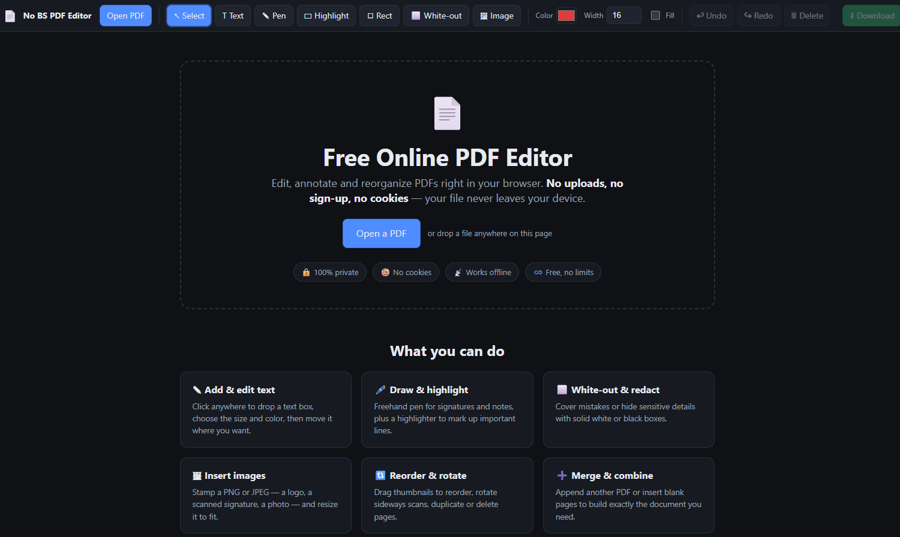

# No BS PDF Editor

[](https://github.com/igor-couto/no-bs-pdf.com/actions/workflows/cicd.yml)



A private, **fully client-side** PDF editor. Open a PDF, mark it up, reorganize pages,
and download the result. Your file is read, edited, and saved entirely in the browser —
**it is never uploaded to any server.** No cookies, no tracking, no accounts, no storage.

## What it does

- **Open** a PDF (file picker or drag &amp; drop)
- **Annotate**: add text, freehand pen, highlighter, rectangles, white-out (cover/redact), and stamp PNG/JPG images
- **Select / move / resize / delete** annotations; **undo / redo**
- **Pages**: reorder (drag thumbnails), rotate, duplicate, delete, insert blank pages, and **append another PDF**
- **Download** the edited PDF

## How privacy works

This app makes **zero third-party requests**. The two open-source libraries it uses —
[PDF.js](https://mozilla.github.io/pdf.js/) for rendering and
[pdf-lib](https://pdf-lib.js.org/) for writing — are **vendored locally** in `vendor/`,
so the only things ever loaded are files from this folder. Nothing is fetched from a CDN
at runtime.

**Your document is never part of any request.** It's read with the File API, edited in
page memory, and written back out with the browser's download mechanism (a `blob:` URL).
There is no backend, no upload, no `fetch`/`XHR` of your bytes, and nothing is written to
cookies, `localStorage`, or `IndexedDB`. It runs fully offline.

> The files in `vendor/` are the unmodified library builds (`pdf.min.js`,
> `pdf.worker.min.js` from PDF.js 3.11.174, and `pdf-lib.min.js` from pdf-lib 1.17.1).
> To update them, replace the files in `vendor/` with newer builds of the same names.

## Run it

It's just static files. Either open `index.html` directly, or (recommended, so the
PDF.js worker runs off the main thread and the SEO files are served with correct content
types) serve the folder with the bundled zero-dependency Node server:

```powershell
node .claude/serve.mjs . 8000
```

Then open `http://localhost:8000`

(Any static host works in production — Netlify, GitHub Pages, S3, nginx, etc.)

After changing `app.js` or `styles.css`, regenerate the served minified files:

```powershell
npx --yes terser@5 app.js --compress --mangle --format ascii_only=true,comments=false -o app.min.js
npx --yes clean-css-cli@5 styles.css -o styles.min.css
```

## Notes &amp; limits

- Text is rendered with the standard **Helvetica** font on export.
- Encrypted/password-protected PDFs must be unlocked first.
- Combining heavy text placement with per-page rotation can have minor orientation quirks;
  position is always preserved. Rotation 0 (the common case) is exact.

## Author

* **Igor Couto** - [igor.fcouto@gmail.com](mailto:igor.fcouto@gmail.com)
